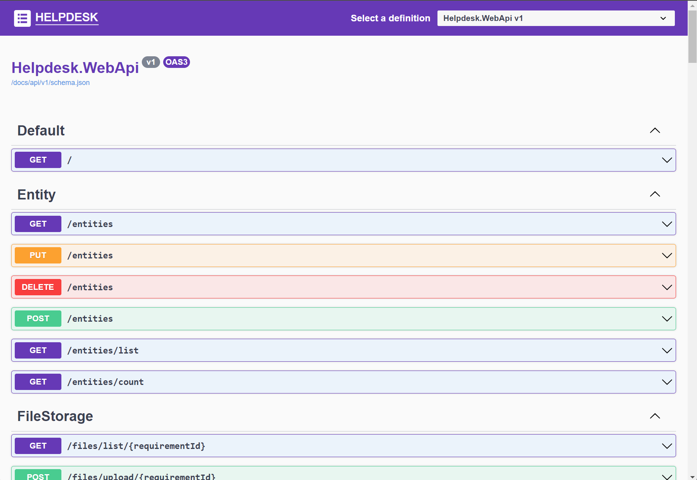
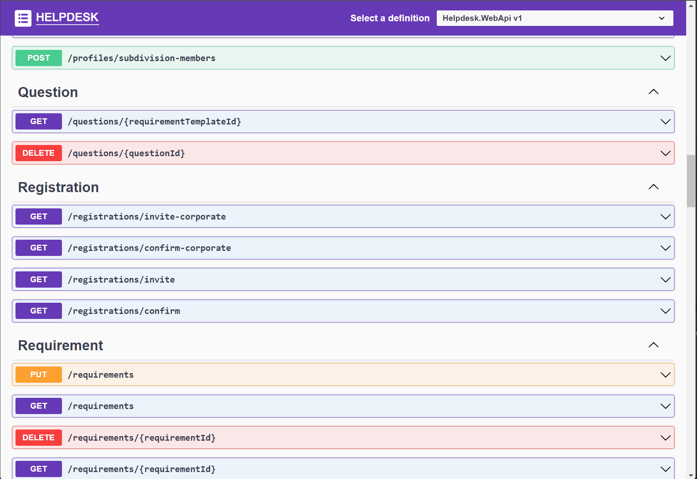

# Getting Started with Helpdesk WebApi

Install and running

1. Open solution folder with VSCODE (or Rider)

2. Restore dependencies

        dotnet restore

3. Open with browser swagger console this web api

        http://localhost:7004/docs/api/index.html

 

